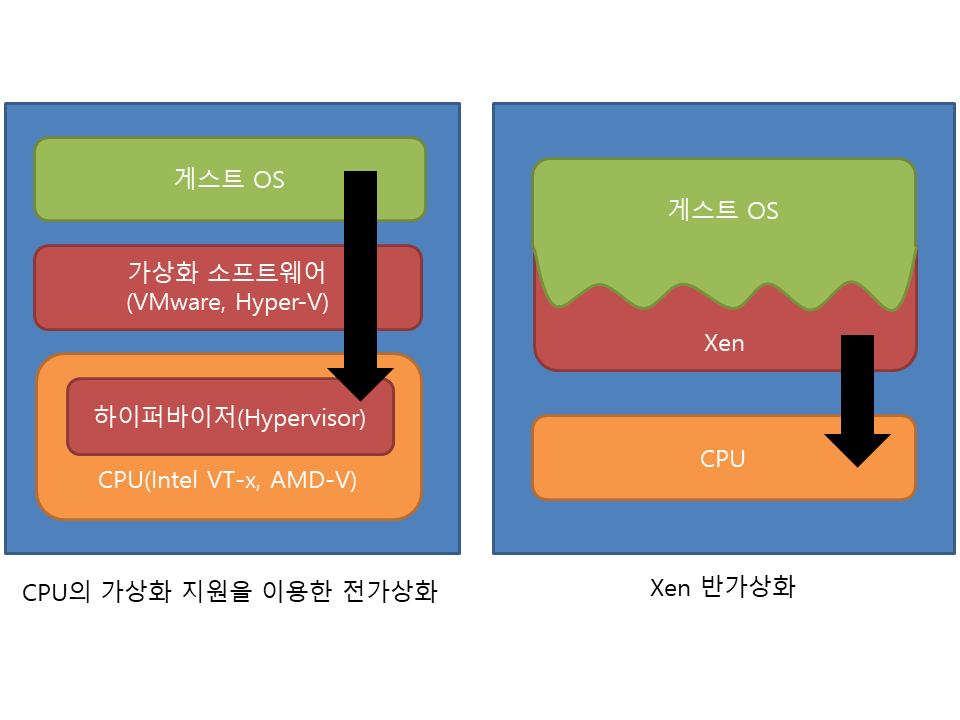
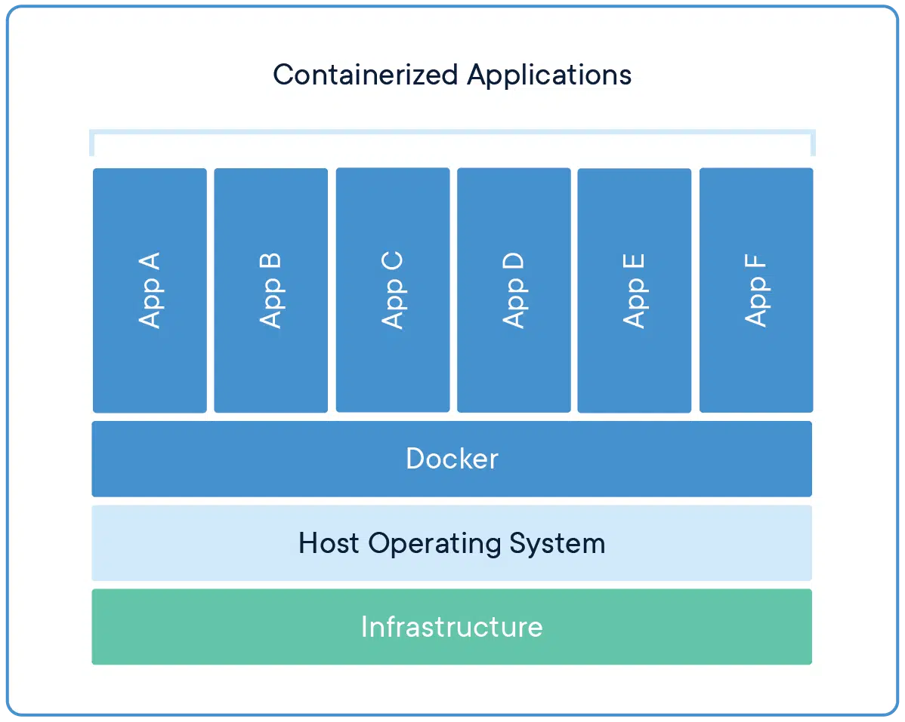
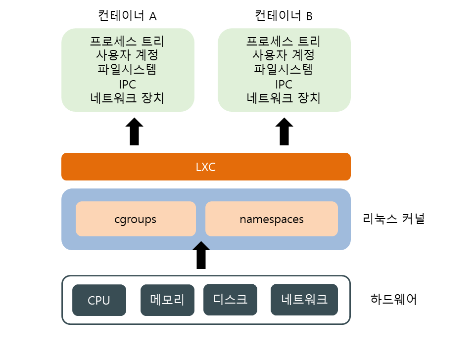
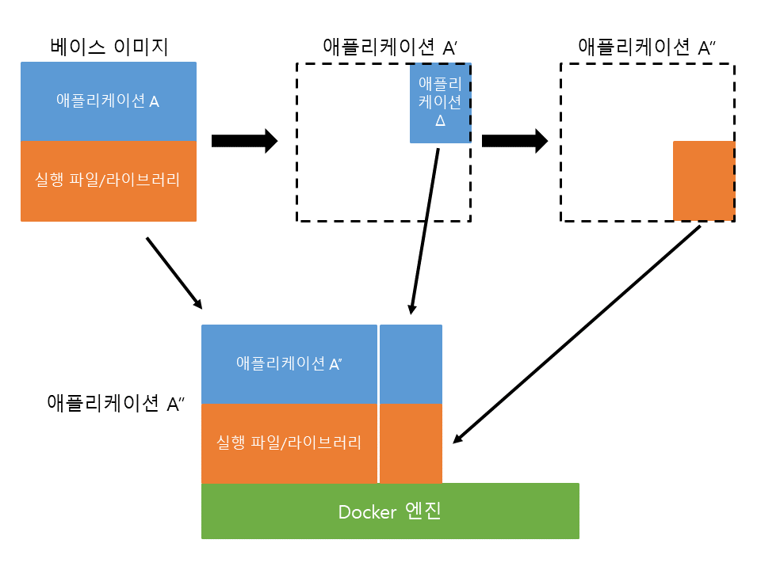

# Docker

### 기존의 가상 머신의 단점

- 가상 머신 자체는 아래와 같이 완전한 컴퓨터라 항상 게스트 OS를 설치해야 됌 이미지안에 OS포함이기 떄문에 용량이 증가

### Docker

- 반가상화보다 좀더 경량화된 방식
- 반가상화와 달리 프로그램과 라이브러리만 격리해서 설치하고 OS자원은 호스트와 공유 → 이미지 용량이 줄어듬

### 리눅스 컨테이너(LXC)

컴퓨터를 통째로 가상화하여 OS를 실생하는 것이 아닌 **리눅스 커널 레벨**에서 제공하는 일종의 격리된 **가상공간**이다. OS가 설치가 안돼 가상머신이라 부르지 않고 **컨테이너**라고 부른다

Docker는 LXC기반으로 구현했습니다. 그렇지만 최근 부터는 Containerd(runC)를 개발하여 사용중이다.

### 이미지

Redis나 Nginx등이 베이스 이미지이다.

베이스 이미지는 필요한 프로그램과 라이브러리, 소스를 설치한 뒤 파일 하나로 만든 것이다.

매번 베이스 이미지에 필요한 프로그램과 라이브러리, 소스를 설치하는 것이 아니라 위에 그림처럼 애플리케이션 부분만 이미지로 생성하고 실행할 때 합쳐서 실행합니다

### 유저랜드

OS는 메모리 사용을 기준으로 커널 공간과 유저 공간으로 나눌 수 있습니다. 여기서 유저 공간에서 실행되는 실행 파일과 라이브러리를 유저랜드라 한다. 배포시 리눅스 커널만으로 안되기 떄문에 고유의 패키징 시스템을 포함한다.

## 느낀점

Docker를 알고 쓰는 느낌과 모르고 쓰는 것은 공부한 이후로 다르다. 이전 프로젝트를 진행할 때 서로 다른 서버에서 DB를 공유하려면 Docker를 사용하면 연결할 수 있다해서 그냥 기계적으로 사용했는데  실행 원리를 아니 관리를 잘 할 수 있을것 같다.