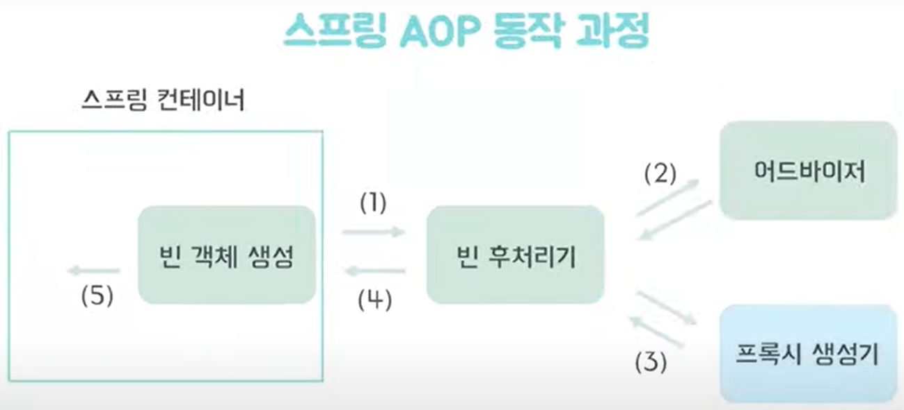
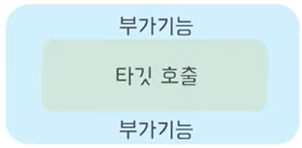

AOP(Aspect Oriented Progranning)

- 관점 지향 프로그래밍
- 횡단 관심사를 분리

→ 애플리케이션에서 코드가 중복되고 강력하게 결합되어 있어

다른 로직과 분리를 할 수 없는 애플리케이션 로직을 분리

AOP의 장점

- 전체 코드 기반에 흩어져 있는 관심 사항이 하나의 장소로 응집
- 코드가 간결해짐, 가독성 좋아짐 → 유지보수가 용이

AOP 용어

- Target : 부가기능을 부여할 대상

  ex : CartService

- Advice : 타깃에게 제공할 무슨 부가기능을 담을지, 어느시점에 주입할 지를 정의

  ex: 메소드 실행 시간 체크

- JoinPoint : 어드바이스가 적용될 수 있는 위치
- Pointcut : 어드바이스를 적용할 조인 포인트를 선별하는 작업
- Adviosr : 포인트컷과 어드바이스를 하나씩 갖고 있는 오브젝트
- Weaving : 조인 포인트에 어드바이스를 적용하는 방법

AOP동작 원리

1. BeanPostProcessor 빈 후처리기

빈 객체 생성 ↔ 빈 후처리기

생성된 빈 객체를 스프링 컨테이너에 등록하기 전에 조작하는 객체

1. 생성된 빈 전달
2. 빈 교체 대상 확인 (어드바이저 내의 포인트컷을 이용해 전달받은 빈이 프록시 적용 대상인지 확인)
3. 빈 교체 대상이 맞다면 이를 생성
4. 교체하거나 전달받은 빈을 반환한다.( 프록시를 생성한 빈이면 프록시 객체를 아니면 그냥 원래의 빈을 반환)
5. 반환된 빈 객체를 컨텍스트에 등록

- 프록시

원본 객체를 감싼 새로운 객체로 클라이언트가 객체를 직접호출하지 않고 프록시로 호출하게 되면서 부가 기능을 추가할 때 사용하는 패턴

1. AspectJ 포인트컷 표현식

execution( *{모든타입} *{이름} (…{모든 객체}))

1. 애너테이션
    1. After - 메서드 반환 or 예외 상황 발생 이후
    2. AfterReturning - 메서드가 반환된 이후
    3. AfterThrowing - 예외상황 발생시킨 이후
    4. Before - 메서드 호출전
    5. Around - 메서드 호출전과 반환 or 예외상황 이후 호출

1. 실습
    1. AOP 의존관계 추가
    2. @Component 빈등록
    3. @Aspect 어드바이저 생성
    4. @PointCut 포인트 컷 설정
    5. EX) @Around(”pointcut()”) 어드바이스 + 포인트 컷 설정
    6. 메서드 구현
    7. @Configuration에서 @EnableAspectAutoProxy를 추가하면 부가기능을 타깃의 메소드를 실행할 수 있다.

## 느낀점

프로젝트하면서 아 이거 편하겠다고 쓴 기능이 AOP였던 것에 놀랐다. 이전 프로젝트하면서 오류처리를 하려고 어드바이저에 오류처리를 담고 컨트롤러에 썼는데 이게 AOP인줄 몰랐다. AOP공부하면서 다른 것에 응용을 하면 쓸 곳이 많을 것 같다.