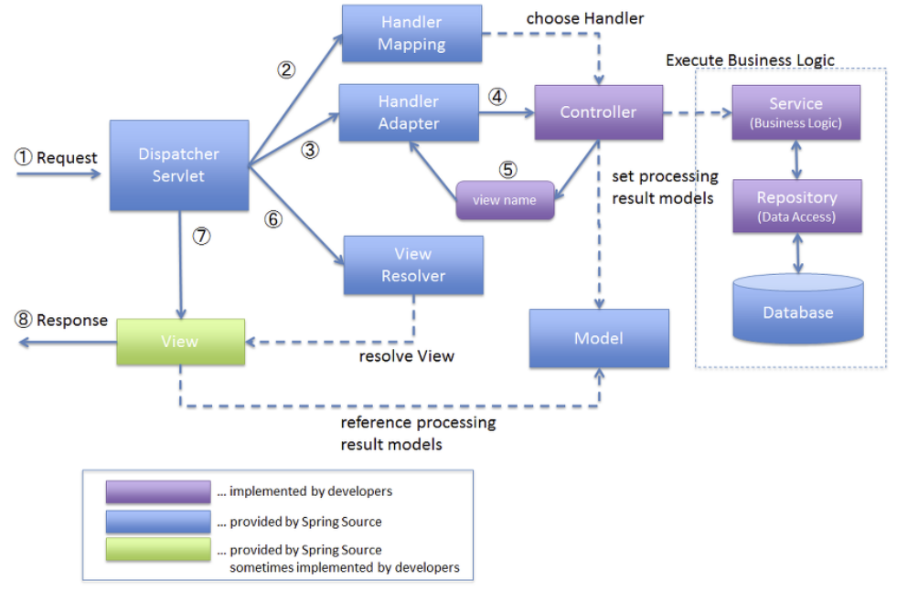

# 스프링

## 프레임워크 vs library

- 프레임워크

설계와 구현을 재사용 가능하게 협업화된 형태로 클래스들을 제공

- 라이브러리

자주 사용되는 로직을 재사용하기 편하도록 정리한 코드의 집합

- 둘의 차이점

라이브러리는 모든 개발의 흐름을 개발자가 제어

프레임워크는 프로그램이 흐름을 제어

## 스프링 프레임워크

자바 오픈소스 어플리케이션 프레임워크, 엔터프라이즈급

## 스프링 프레임워크 특징

- IOC 제어의 역행

모든 객체에 대한 제어권을 프레임워크가 가짐

- DI 의존성 주입

클래스를 Bean으로 등록되면 프레임워크가 찾아줘서 주입해줌 → 모듈간 결합도 낮춤

- AOP 관점 지향 프로그래밍

로그, 트랜잭션, 성능확인 등 공통적인 관심사가 중복되는 문제점 해결하기 위해 프록시 패턴 사용하여 코드 분리

- PAS 추상화를 통해 코드가 간결

어노테이션을 만들어 놓아 선언하면 내부적으로 동작이 됨

- POJO 순수 자바 객체

맴버 변수와 Getter와 Setter로 구성된 가장 순수한 형태의 기본 클래스

## MVC 디자인 패턴

- Model

애플리케이션의 정보, 데이터의 가공, 비지니스 로직을 처리하는 모듈이다 → 컴포넌트

- View

클라이언트 단에서 보여지는 결과화면

- Controller

client로부터 request가 들어왔을 때 어떤 로직을 실행시킬 것인지 Model과 View를 연결해주며 제어하는 모듈

- MVC1

사용자 ↔ JSP ↔ Model ↔ DB

- MVC2

사용자 →(요청) Servlet(Controller) ↔ Model ↔ DB

     ←  JSP(View)     ←

Servlet : 비지니스 로직을 수행하며 모델을 호출하여 데이터 요청, 최종적으로 jsp 페이지로 포워딩하여 화면 출력

## Spring Framework의 동작 원리

- DispatchServlet

애플리케이션으로 들어오는 모든 Request를 받는 부분, controller에 전달, 결과값을 view에 전달해서 흐름제어

- HandlerMapping

Request URL에 따라 어떤 Controller가 처리할 것인지 찾아줌

- Controller

Request처리, DispatchServlet에게 전달

- ModelAndView

Controller가 처리한 결과와 그 결과를 보여줄 View에 관한 정보를 담고있는 객체

- ViewReslover

포워딩할 view파일을 찾아줌

## 느낀점

스프링을 다시 공부하니 처리 흐름을 그 전에는 잘 이해되지 않았던 부분이 이해가 잘 됐다. 스프링 시큐리티를 공부하기 전에 복습느낌으로 하니 시큐리티를 이해하는데 더 잘 될 것 같다