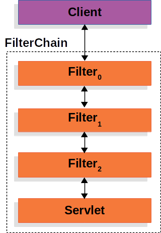
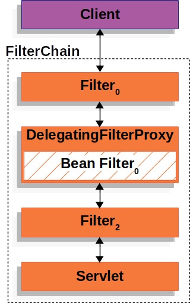
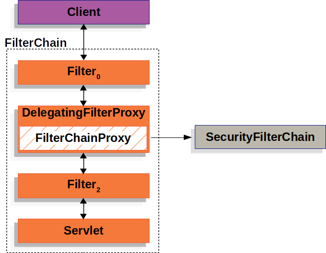
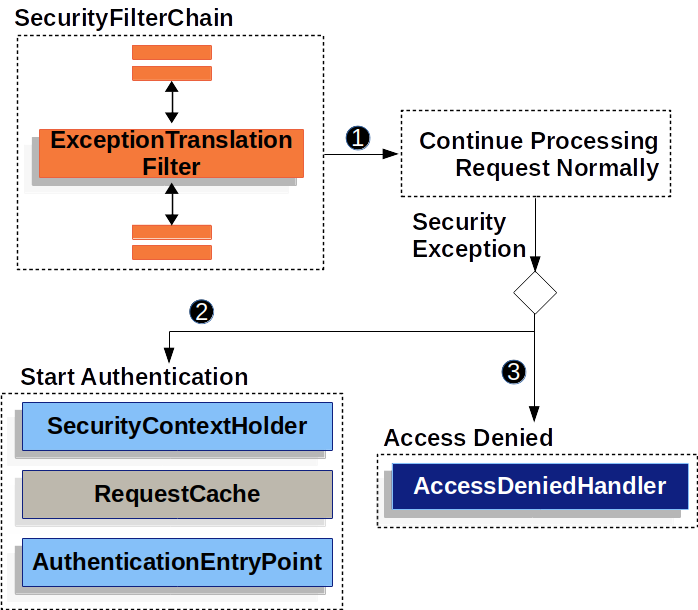

# 스프링 시큐리티

## 스프링 시큐리티

인증, 인가, 악용 방지들의 기능을 제고하는 보안 프레임워크, 서블릿 필터를 기반으로 동작하며, 요청이 필터 체인을 거쳐 처리됨

## Filler와 FilterChain

- 필터란?

웹 어플리케이션에서 클라이언트 요청이 들어오면 필터가 이를 가로채서 특정 작업을 수행한 후 다음 필터또는 서블릿으로 전달

- FilterChain이란?

여러 개의 필터들이 하나의 체인처럼 연결된 구조를 의미, 특정 요청이 들어오면 여러 개의 필터들이 차례대로 실행



### **FilterChain 사용 예시**

```java

public void doFilter(ServletRequest request, ServletResponse response, FilterChain chain) {
    // 요청이 필터 체인을 통과하기 전에 실행
    chain.doFilter(request, response); // 다음 필터 또는 서블릿 호출
    // 요청이 필터 체인을 통과한 후 실행
}
```

- **서블릿(Servlet)**: 웹 요청을 처리하는 자바 클래스

## DelegatingFilterProxy

Spring Security는 DelegatingFilter를 사용하여 서블릿 컨테이너와 스프링 컨텍스트를 연결

- 사용 이유

서블릿 컨테이너는 필터를 직접 등록하지만 Spring에서 관리하는 빈은 알지 못함.



### **DelegatingFilterProxy 동작 방식**

```java
public void doFilter(ServletRequest request, ServletResponse response, FilterChain chain) {
    Filter delegate = getFilterBean("springSecurityFilterChain");
    delegate.doFilter(request, response);
}
```

- **ApplicationContext**: 스프링 컨테이너의 인스턴스로, 애플리케이션에서 사용되는 객체인 빈을 생성하고 관리합니다
- **Bean**: 스프링에서 관리하는 객체

## FilterChainProxy

스프링 시큐리티의 핵심, 이 필터는 여러 개의 보안 필터를 관리, 요청에 따라 적절한 보안 필터 실행

- 역할
1. 여러 개의 SecurityFilterChain을 관리
2. 요청 URL에 따라 적절한 필터 체인 선택
3. 필터 실행 순서 조정



### **FilterChainProxy 동작 예시**

```java

@Bean
public SecurityFilterChain filterChain(HttpSecurity http) throws Exception {
    http
        .csrf(Customizer.withDefaults())
        .httpBasic(Customizer.withDefaults())
        .authorizeHttpRequests(auth -> auth.anyRequest().authenticated());

    return http.build();
}

```

- **HttpSecurity**: 보안 설정을 구성하는 객체
- **SecurityFilterChain**: 특정 요청 패턴에 적용되는 필터들의 집합

## Security Filter

필터의 종류

| 필터 이름 | 역할 |
| --- | --- |
| CsrfFilter | CSRF 공격 방지 |
| UsernamePasswordAuthenticationFilter | 폼 로그인 처리 |
| BasicAuthenticationFilter | HTTP 기본 인증 처리 |
| AuthorizationFilter | 인가 수행 |

### **필터 순서 예시**

```java

@Configuration
@EnableWebSecurity
public class SecurityConfig {

    @Bean
    public SecurityFilterChain filterChain(HttpSecurity http) throws Exception {
        http
            .csrf(Customizer.withDefaults()) // CSRF 보호
            .httpBasic(Customizer.withDefaults()) // HTTP 기본 인증
            .authorizeHttpRequests(auth -> auth.anyRequest().authenticated()); // 모든 요청 인증 필요

        return http.build();
    }
}

```

🔹 **CSRF (Cross-Site Request Forgery)**: 사용자의 의도와 상관없이 요청이 실행되는 공격 기법

## 필터 추가 및 커스터마이징

보안 요구 사항에 따라 Spring Security에 새로운 필터를 추가할 수 있습니다.

### **필터 추가 방법**

```java

@Bean
public SecurityFilterChain filterChain(HttpSecurity http) throws Exception {
    http
        .addFilterAfter(new CustomFilter(), UsernamePasswordAuthenticationFilter.class);
    return http.build();
}

```

- **addFilterBefore**: 특정 필터 앞에 추가
- **addFilterAfter**: 특정 필터 뒤에 추가
- **addFilterAt**: 특정 필터를 대체

## 보안 예외 처리

ExceptionTranslationFilter를 사용해서 예외 처리

- 예외 처리 방식
1. 인증이 필요한 요청이 들어오면, 사용자가 인증되지 않았을 경우 AuthenticationException 발생
2. 인가되지 않은 요청이 들어오면, AccessDeniedException 발생
3. ExceptionTranslationFilter가 예외를 감지하여 적잘한 응답 반환



### **ExceptionTranslationFilter 의사 코드**

```java

try {
    filterChain.doFilter(request, response);
} catch (AccessDeniedException | AuthenticationException ex) {
    if (!authenticated || ex instanceof AuthenticationException) {
        startAuthentication();
    } else {
        accessDenied();
    }
}
```

- **AuthenticationException**: 인증되지 않은 사용자 요청 시 발생하는 예외
- **AccessDeniedException**: 권한이 없는 사용자가 접근하려고 할 때 발생하는 예외

## Request Caching

사용자가 로그인 후 원래 요청을 다시 실행할 수 있도록 요청을 저장하는 기능

### **기본 RequestCache 사용**

```java

@Bean
public SecurityFilterChain filterChain(HttpSecurity http) throws Exception {
    http
        .requestCache(cache -> cache.requestCache(new HttpSessionRequestCache()));
    return http.build();
}

```

### **요청 저장 비활성화**

```java

@Bean
public SecurityFilterChain filterChain(HttpSecurity http) throws Exception {
    http
        .requestCache(cache -> cache.requestCache(new NullRequestCache()));
    return http.build();
}

```

- **RequestCache**: 인증 후 이전 요청을 복원하는 역할
- **NullRequestCache**: 요청 저장을 비활성화

## 로깅

### **로깅 설정**

```
properties
복사편집
logging.level.org.springframework.security=TRACE

```

### **로그 예시**

```

DEBUG  o.s.security.web.FilterChainProxy - Securing POST /hello
TRACE  o.s.security.web.FilterChainProxy - Invoking CsrfFilter (5/15)
DEBUG  o.s.security.web.csrf.CsrfFilter - Invalid CSRF token found for http://localhost:8080/hello
DEBUG  o.s.s.w.access.AccessDeniedHandlerImpl - Responding with 403 status code

```

- **TRACE 로그**: 상세한 보안 필터 동작을 확인할 수 있음

## 느낀점

스프링 시큐리티를 공부하니 필터를 어떻게 설정해야 되고 어떻게 배치해야하는지 배웠다. 그리고

RequestCaching을 통해 요청을 저장하고 자주사용되는 요청을 재활용할 수 있을 것 같다. 후에 jwt도 공부할 예정인데 이해할 때 도움이 될것 같다.