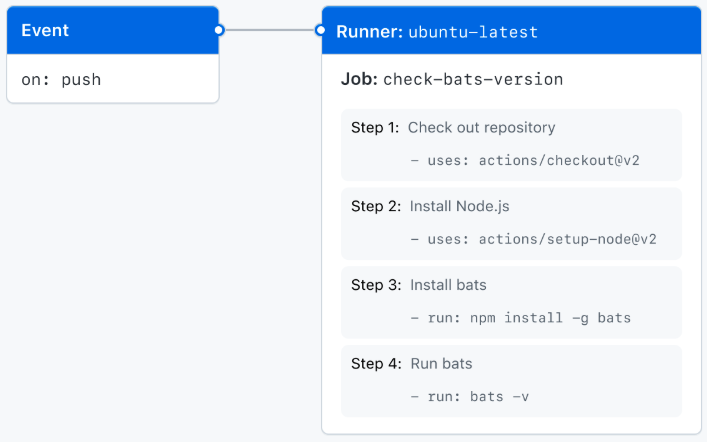

# 깃 액션

## Workflow

- 한개 이상의 job을 실행할 수 있는 자동화된 작업
- YAML 파일로 저장되며 event에 의해 실행

## Event

- workflow 실행을 발동시키는 특정한 활동
- 깃허브에 소스코드를 푸시하면 발생하는 push event, pull request event, issue event등

  깃허브에서 발생하는 대부분의 작업을 event로 정의


## Jobs

- 한가지 러너안에서 실행되는 여러가지 step들의 모음
- 각각의 step들은 일종의 shell script 처럼 실행이 됩니다.
- Step들은 순서에 따라 실행되며 Step끼리 데이터 공유 가능
- Job은 다르 Job에 의존관계를 가질 수 있으며 병렬 실행 가능

## Actions

- 복잡하고 자주 반복되는 작업을 정의한 커스텀 어플리케이션
- Workflow 파일 안에서 자주 반복되는 코드를 미리 정의해 코드의 양을 줄일 수 있다.
- 깃허브 마켓플레이스를 통해 공용 Action 또는 다른 사람들이 만든 Action을 사용

## name

- Workflow의 name, 선택사항

## On

- 해당 workflow를 실행시키는 이벤트를 정의
- push 이벤트가 발생했을 때 workflow가 실행되도록 정의

## jobs

- check-bats-version-job의 이름을 정의]
- runs-on : 어떤 호스트에서 실행될지 정의 - ubuntu 가상 머신에서 실행 되도록 정의

사용예시



```yaml
name: learn-github-actions
on: [push]
jobs:
  check-bats-version:
    runs-on: ubuntu-latest
    steps:
      - uses: actions/checkout@v2
      - uses: actions/setup-node@v2
        with:
          node-version: '14'
      - run: npm install -g bats
      - run: bats -v
```

## 느낀점

CICD를 하려고 깃 액션을 배웠는데 push와 pull request등 이벤트가 다양해서 상황에 맞게 쓸 수 있어서 유용했던 것 같다. IDE에서 코드를 올리고 클라우드에 직접 안넣어도 github에서 자동으로 올려주니까 편하다.