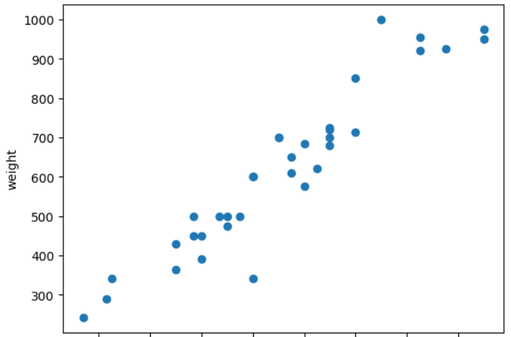

# 혼자 공부하는 머신런닝, 딥러닝

## 머신러닝과 딥러닝
머신러닝: 규칙을 프로그래밍하징 낳아도 자동으로 데이터에서 규칙을 학스합는 알고리즘
<br>딥러닝: 머신러닝중 인공신경망을 기반으로 한 방법
<br><br>
## 사용할 도구
- 코랩<br>

구글에서 제공하는 웹 브라우저 기반의 파이썬 코드 실행 환경

## 사용할 알고리즘
- K-최근접 이웃 알고리즘
어떤 데이터에 대한 답을 구할 때 주위의 다른 데이터를 보고 다수를 차지하는 것을 정답으로 사용한다.

## 사용할 함수
- matplotlib
scatter()는 산점도를 그리는 맷플롯립 함수입니다.
- scikit-learn(머신러닝 패키지)
fir()은 사이킷런 모델 훈련할 때 사용하는 메서드 처음 두 매개변수로 훈련에 사용할 특성과 정답 데이터를 전달
<br>predict()는 사이킷런 모델을 훈련하고 예측할 때 사용하는 메서드
<br>score()는 훈련된 사이킷런 모델의 성능을 측정합니다.

## 사용할 데이터

 
`bream_length = [25.4, 26.3, 26.5, 29.0, 29.0, 29.7, 29.7, 30.0, 30.0, 30.7, 31.0, 31.0,
31.5, 32.0, 32.0, 32.0, 33.0, 33.0, 33.5, 33.5, 34.0, 34.0, 34.5, 35.0,
35.0, 35.0, 35.0, 36.0, 36.0, 37.0, 38.5, 38.5, 39.5, 41.0, 41.0]`
<br>`bream_weight = [242.0, 290.0, 340.0, 363.0, 430.0, 450.0, 500.0, 390.0, 450.0, 500.0, 475.0, 500.0,
500.0, 340.0, 600.0, 600.0, 700.0, 700.0, 610.0, 650.0, 575.0, 685.0, 620.0, 680.0,
700.0, 725.0, 720.0, 714.0, 850.0, 1000.0, 920.0, 955.0, 925.0, 975.0, 950.0] `

## 산점도 찍기
```
import matplotlib.pyplot as plt

plt.scatter(bream_length, bream_weight)
plt.xlabel('length')
plt.ylabel('weight')
plt.show()
```
<br>scatter함수를 이용해서 산점도 그림 



## 훈련데이터 만들기

<br> 빙어 데이터 추가

```
smelt_length = [9.8, 10.5, 10.6, 11.0, 11.2, 11.3, 11.8, 11.8, 12.0, 12.2, 12.4, 13.0, 14.3, 15.0]
smelt_weight = [6.7, 7.5, 7.0, 9.7, 9.8, 8.7, 10.0, 9.9, 9.8, 12.2, 13.4, 12.2, 19.7, 19.9]
```
<br>
두 데이터 리스트 합치고 2차원 리스트로 만들기

```
length = bream_length + smelt_length
weight = bream_weight + smelt_weight
fish_data = [[l, w] for l, w in zip(length, weight)]
```
<br>
데이터 기준 나누기

```
fish_target = [1]*35 + [0]*14 # 도미는 1 빙어는 0
```
<br>
k-최근접 이웃 알고리즘 거져오기

```
from sklearn.neighbors import KNeighborsClassifier
kn = KNeighborsClassifier() # k-최근접 이웃 알고리즘
```

<br>
데이터 훈련 및 예측

```
kn.fit(fish_data, fish_target) # 학습하기
kn.score(fish_data, fish_target) # 정확도는 0~1사이 이다.
kn.predict([[30,600]]) # 데이터 예측
```
예측한 결과는 1로 100%을 뜻한다.

## 느낀점
머신러닝의 기초를 알 수 있었다. 훈련할 데이터를 준비하고 훈련 기준을 나누고 학습을 시키는 것 말 그대로 머신러닝 맛보기를 했다. 
아직까진 단순히 크기로 나눈 느낌이라 더 자세한 기준으로 나눌 필요가 있었으면 좋겠다.