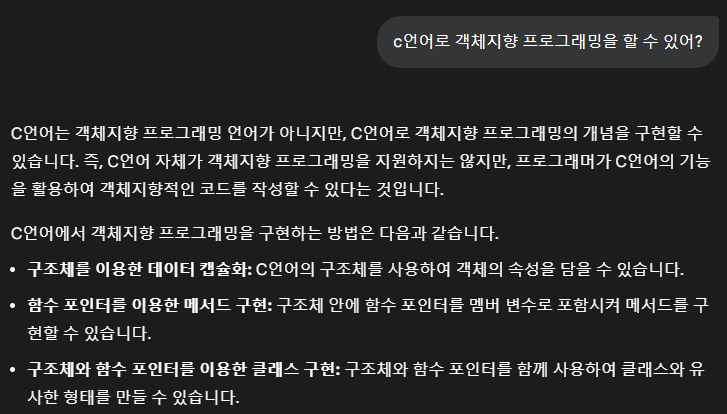

# 자바/스프링 개발자를 위한 실용주의 프로그래밍

비전공자 : 웹 개발만 익혀서 지식이 치우쳐 있고 개발 역량이 부족해서 깊이나 스펙트럼이 넓지 못함

전공자 : 학부 시정에 기술을 학습해본 적이 없어 기술에 대한 학습 스택은 조금 부족함 그렇지만 확장하는 속도가 빨라 조그만 공부해도 바로 웹개발자가 될 수 있음 그래서 더 선호함
 
- 객체지향, 테스트, 아키텍처를 잘 이해하는 백엔드 개발자가 되자 → 이 책의 목적

 
 
- 순차지향 vs 절차지향
    
  - 의미는 같다
  - 순차지향 :순차는 명칭대로 순차적으로 프로그래밍이다.
  - 절차지향: Procedure(절차)는 컴퓨터 공학에서는 함수라서 함수 지향 프로그래밍이다.
   
   
  
- 그럼 객체지향은 뭘까?
    - 우리가 쓰는 객체지향 코드는 객체지향이 아니다. c언어의 구조체와 다를게 없다.
    - 우리가 보통 쓴 코드는 serivce 메서드에 처리했다 → 비지니스 로직을 객체가 처리하게 해서 책임을 분배를 한다. → 이걸 응집도를 높였다라고 한다
    - 객체지향은 책임이 중요 키워드이다.

 

- c언어는 왜 객체지향 언어가 아닐까

자바는 인터페이스(추상화)로 책임을 분할한다( 다형성) 

단순히 c언어는 문법적으로 클래스를 지원을 안해서 객체지향 언어가 아니라
  
- TDA 원칙

조건문때 묻지 낳는다

getter와 setter의 무분별 사용하지 마라

객체에 책임을 전가해라

## 느낀점

이건 c언어에서도 그렇게 처리 할 수 있는 것 아닌가….? 그렇다고 c언어를 객체지향언어로 부르진 않는다 라고 생각했지만
 

 
c언어도 객체지향 프로그래밍을 할 수 있다는 것을 알았다.  예전에 c언어 프로그래밍을 할 때   교수님에게 배웠던 것이 함수를 써서 main함수에 넣어라 main함수는 로직을 쓰는게 아니다라고 배웠는데 이게 다 캡슐화를 배웠던 것이었다. 덤으로 유지보수가 쉬워진 것이었다.
그런데 바로 뒷장에서 c언어도 할 수 있지만 결정적으로 왜 아니라는 내용이 나와서 놀랬다.
    
