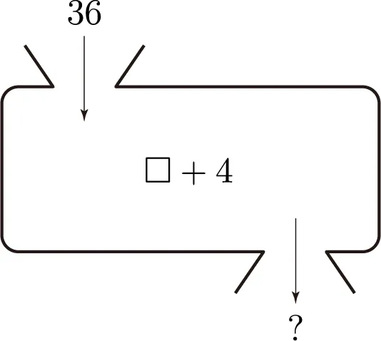

## 덕타이핑

상속을 안해도 행동이 같으면 같은 클래스로 본다

## 인터페이스

인터페이스는 행동이 아니다

기능을 조작하고 싶다면 이런 메세지를 날리면 된다는 창구이다.

협력을 위해 객체들은 인터페이스를 통해 메시지를 주고 받는다

그래서 private로 메서드를 선언하면 인터페이스 존재이유가 없기때문에 public으로만 선언을 한다

## 행동과 역할

클래스를 만들때 역할에 집중하면 훨씬 유연한 설계를 얻을 수 있다.

## 함수vs 메서드

인터페이스를 이용한 통신에서 메시지를 보내면서도 어떤 메서드가 실행될 지 모른다. → 이것은 함수의 개념으로는 메서드를 정의할 수 없다라는 뜻을 뜻한다.

왜냐하면 함수는 어떠한 값을 넣으면 위와 같이 값을 주는데 메서드는 아니기 때문이다.

객체지향에서는 객체들은 메시지를 통해 소통을 한다

## 느낀점

3장의 주요 내용은 객체를 만들때는 역할과 행동을 잘 생각하라고 하며 인터페이스를 잘 작성하면 된다 이렇게 말하길래 추상화와 다형성이 중요하다라는 말을 이 장에서 강조하고 싶었구나라는 생각이 들었지만 끝에는 이 책저자는 역할과 추상화는 다르기 때문에 단순히 추상화를 많이 하라는게 아니라 역할과 행동에 중요하다라는 것을 알려주고 싶었다는 것을 알 게 됐다. 읽으면 읽을 수록 기존의 생각이 좀 많이 달라지는 것 같다.