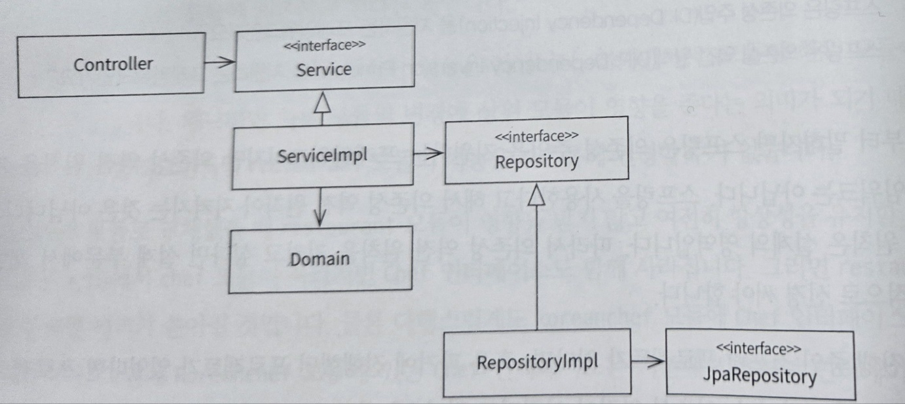
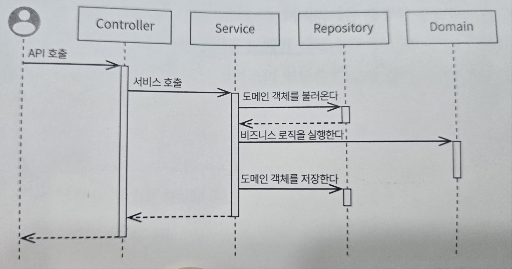

# 안티패턴

- 스마트 UI

컨트롤러에는 비지니스 로직이 있으면 안된다. DB관련 로직도 있으면 안된다.

- 양방향 레이어드 아키텍처

레이어드 아키텍처란?

레이어란 분류체계를 사용하며 MVC패턴과 유사하다.

예를 들어 컨트롤러가 서비스에 의존하고 서비스가 컨트롤러에 의존하면 양방향 레이어드 아키텍처가된다.

이를 해결하기 위해 클래스를 하나의 코어 패키지로 옮기고 의존하게 만들면 된다.

- 레이어드 아키텍처중 레이어를 건너뛰고 스킵하는 행위

1 → 2 → 3 ⇒ 1 → 3

예를 들어 컨트롤러에서 레포지토리를 사용하는 행위

- 스프링 지향해야 할 구조

- 스프링 시퀀스 다이어그램

여기서 말하고 싶은 말은 비지니스 로직은 도메인에서 처리해야 된다 라는 말을 저자는 하고 싶어한다.

## 느낀점:

객체지향 말만 했지 정작 스프링할 때는 이 책을 읽으면서 실천한 적이 없는 것 같다. 그냥 할 일을 service에만 박아둔 기억밖에 없다. 이 챕터를 읽으면서 controller와 service의 역할을 잘 알고 가는 것같다.